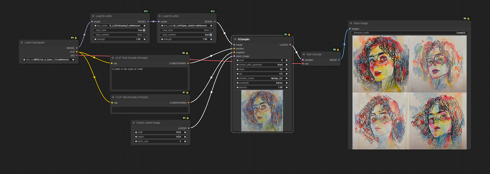
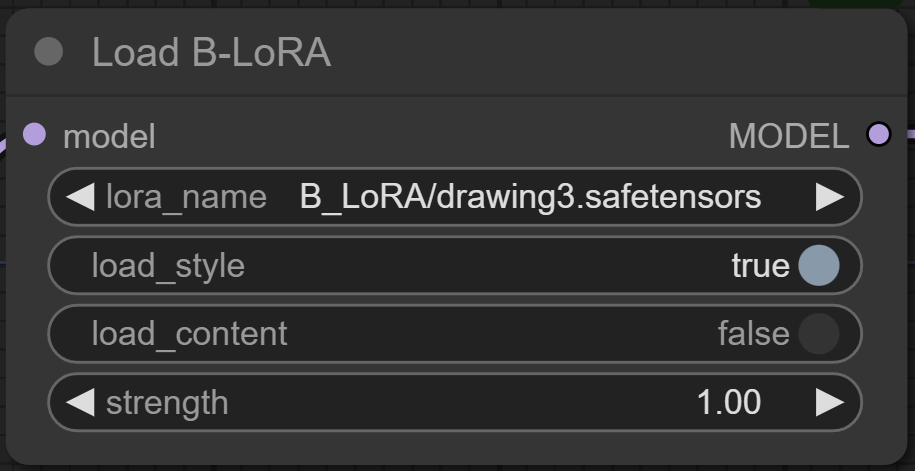

# ComfyUI-B-LoRA

A ComfyUI custom node that loads and applies B-LoRA models.




## What is B-LoRA?

B-LoRA: By implicitly decomposing a single image into its style and content representation captured by B-LoRA, we can perform high quality style-content mixing and even swapping the style and content between two stylized images.

 - 🌐 Website: https://b-lora.github.io/B-LoRA/

 - Code: https://github.com/yardenfren1996/B-LoRA/

 - Currently B-LoRA models only works with SDXL (`sdxl_base_1.0`). (Compatible but not guaranteed with SDXL-based fine-tuned models.)

## Advantages of B-LoRA

1. Can apply `Style` or `Content`, or both.

2. Much smaller model files. (~100M for SDXL B-LoRAs)

3. One B-LoRA only needs one image as training dataset and 15 minutes to train. (on a single RTX 4090)

Please share your B-LoRA models on Civit.ai or HuggingFace!

## Node

### Load B-LoRA



 - `lora_name`: Choose the B-LoRA model you want to load. By default, it'll searches in the `models/loras/` folder for available models.

 - `load_style`: Do you want the style of that B-LoRA?

 - `load_content`: Do you want to content of that B-LoRA?

 - `strength`: How strong do you want that B-LoRA to affect the model?

## Workflow Examples

### A Single Load B-LoRA node


🌟 `<s>` is the training prompt for one B-Lora `colorful-squirrel`

### A B-LoRA for Style, and another for Content


🌟 `<s>` is the training prompt for one B-Lora `colorful-squirrel`, and `<p>` is the training prompt for the other `pencil-boy`.

### B-LoRA models used in the workflows can be downloaded here:

https://huggingface.co/sida/B-LoRA-examples/tree/main

## More pretrained B-LoRAs to try out:

https://huggingface.co/lora-library?sort_models=downloads#models

## Train Your B-LoRAs (WIP):

I'm building a docker image for training. Please check [train](./train/README.md) to see current progress.

## Credit goes to:

 - https://github.com/yardenfren1996/B-LoRA

 - https://github.com/huggingface/diffusers/blob/main/scripts/convert_diffusers_sdxl_lora_to_webui.py

 - https://github.com/yardenfren1996/B-LoRA/issues/7

 - https://github.com/comfyanonymous/ComfyUI/issues/3674

## Citation

If you use B-LoRA in your research, please cite the authors' paper:

```
@misc{frenkel2024implicit,
      title={Implicit Style-Content Separation using B-LoRA}, 
      author={Yarden Frenkel and Yael Vinker and Ariel Shamir and Daniel Cohen-Or},
      year={2024},
      eprint={2403.14572},
      archivePrefix={arXiv},
      primaryClass={cs.CV}
}
```