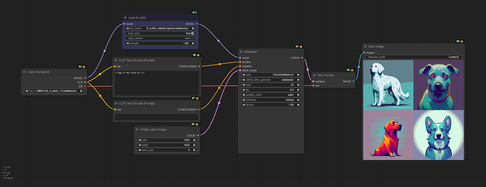
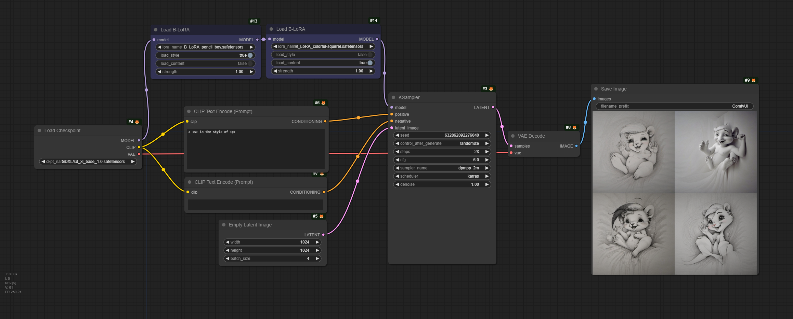

# ComfyUI-B-LoRA (Working in Progress)
Load and apply B-LoRA models, currently B-LoRA models only works with SDXL (`sdxl_base_1.0`).


## B-LoRA
https://github.com/yardenfren1996/B-LoRA

## Advantages of B-LoRA

1. Can differentiate `Style` and `Content`.

2. Much smaller model files. (~100M)

3. Only need one image to train.

## Workflow Examples

### A Single Load B-LoRA node


🌟 `<s>` is the training prompt for one B-Lora `colorful-squirrel`

### A B-LoRA for Style, and another for Content


🌟 `<s>` is the training prompt for one B-Lora `colorful-squirrel`, and `<p>` is the training prompt for the other `pencil-boy`.

### B-LoRA models used in the workflows can be downloaded here:

https://huggingface.co/sida/B-LoRA-examples/tree/main

## Credit goes to:

 - https://github.com/yardenfren1996/B-LoRA

 - https://github.com/huggingface/diffusers/blob/main/scripts/convert_diffusers_sdxl_lora_to_webui.py

 - https://github.com/yardenfren1996/B-LoRA/issues/7

 - https://github.com/comfyanonymous/ComfyUI/issues/3674

## Citation

If you use B-LoRA in your research, please cite the authors' paper:

```
@misc{frenkel2024implicit,
      title={Implicit Style-Content Separation using B-LoRA}, 
      author={Yarden Frenkel and Yael Vinker and Ariel Shamir and Daniel Cohen-Or},
      year={2024},
      eprint={2403.14572},
      archivePrefix={arXiv},
      primaryClass={cs.CV}
}
```